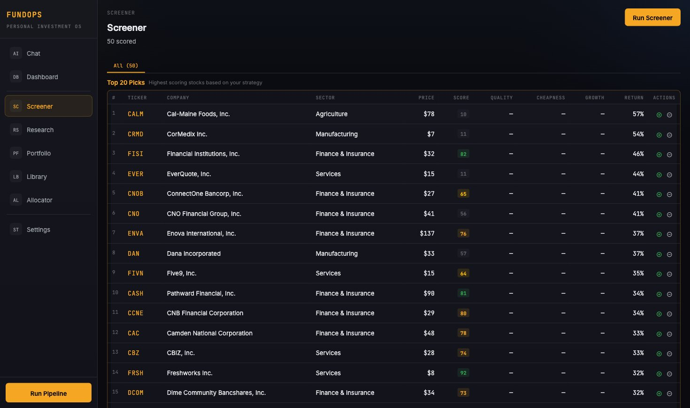

# FundOps

Personal investment research platform powered by AI agents. Run your own hedge fund operations — from screening thousands of stocks to generating deep-dive memos — all from a single dashboard.




## What is this?

FundOps runs a 7-agent pipeline that mirrors how a real investment fund operates:

```
Screener → Thesis → IC Review → Memo → Library
                                        ↕
                              Portfolio + Allocator
```

| Agent | What it does |
|-------|-------------|
| **Screener** | Scores a universe of stocks against your strategy. Supports S&P 500, Nasdaq 100, Russell 2000, or custom ticker lists. |
| **Thesis** | Generates a quick investment thesis with web research, SEC filings analysis, and independent valuation. |
| **IC Review** | Stress-tests the thesis with configurable haircuts and hurdle rates. Only investments that survive the bear case pass. |
| **Memo** | Full deep-dive research report and strategy-tailored investment memo. |
| **Library** | Stores all research artifacts, runs the learning loop (checks prediction accuracy vs actuals), and enables "Ask the Library" search. |
| **Portfolio** | Monitors held positions: live P&L, thesis health checks against SEC data, and news-based drift detection. |
| **Allocator** | Position sizing recommendations, concentration alerts, and buy/trim/exit action items. |

Each agent has exactly one job with no overlap. The pipeline processes top 20 screened candidates through thesis, sends the best 10 to IC review, and generates memos for those that pass.

## Screenshots

The platform includes: AI Strategy Chat, Screener, Research Pipeline, Ticker Detail, Portfolio Monitor, Library, Allocator, and Settings pages.

## Installation

### Prerequisites

- **Python 3.12+** and **Node.js 18+**
- **OpenAI API key** (for AI agents)

### Quick Start

```bash
git clone https://github.com/jhchang0407-lang/fundops.git
cd fundops
npm install        # sets up everything — Python venv, backend, frontend
```

Add your API key:
```bash
# Edit .env and set OPENAI_API_KEY=sk-...
```

Run:
```bash
npm start          # → http://localhost:8000
```

That's it. `npm install` handles the Python virtual environment, pip dependencies, frontend build — everything. One command to install, one command to run.

## Getting Started

### 1. Add your API key

Go to **Settings → AI Model** and paste your OpenAI (or compatible) API key.

### 2. Define your strategy

Go to **Chat** and describe your investment approach in plain English:

> "I'm a deep value investor. I look for small-cap stocks trading at big discounts with recovering margins. Gross margin > 25%, debt/equity < 2. Russell 2000 universe. 3-5 year hold."

The AI will configure all agents to match your strategy. Say "just save it" when you're ready — no need to answer 10 questions.

### 3. Run the pipeline

Click **Run Pipeline** in the sidebar. The pipeline will:
- Screen the Russell 2000 (or your chosen universe) → top 20 candidates
- Generate thesis for each → ranked by expected return
- IC review the top 10 → stress-test with bear case
- Generate memos for stocks that pass IC
- Archive everything to the Library

### 4. Review results

- **Screener** — all scored stocks with fundamentals
- **Research** — thesis results, IC verdicts, approved stocks ready for memos
- **Portfolio** — add positions, track P&L, monitor thesis health
- **Library** — search your research archive, ask questions about any ticker

## Data Sources

| Source | Cost | What it provides |
|--------|------|-----------------|
| **Yahoo Finance** | Free | Stock quotes, P/E, margins, sector data |
| **SEC EDGAR** | Free | 10-K/10-Q filings, financial statements, ratios |
| **OpenAI** | ~$0.01-0.50/pipeline run | AI reasoning for thesis, IC review, memo generation |
| **FMP** | Optional (paid) | Analyst estimates, earnings surprises, price targets |

Yahoo Finance + SEC EDGAR provide complete fundamental data for free.

## Stock Universes

| Universe | Stocks | Description |
|----------|--------|-------------|
| `starter_30` | 30 | Top 30 US large caps — quick testing |
| `nasdaq100` | 101 | Nasdaq 100 — tech-heavy |
| `us_largecap_200` | 207 | Top 200 US by market cap |
| `sp500` | 503 | Full S&P 500 |
| `sp500_nasdaq100` | 517 | Combined S&P 500 + Nasdaq 100 |
| `russell2000` | 1,906 | Russell 2000 small-cap index |

You can also paste a custom ticker list in the Strategy Chat or Settings.

## Architecture

```
fundops/
├── backend/
│   ├── agents/           # 7 AI agents (screener, thesis, IC, memo, library, portfolio, allocator)
│   ├── api/              # FastAPI REST API + background scheduler
│   │   ├── routes/       # Endpoint handlers
│   │   ├── deps.py       # Dependency injection (DB, LLM, connectors)
│   │   └── jobs.py       # Background job queue
│   ├── connectors/       # Data providers (FMP, SEC EDGAR, yfinance)
│   ├── core/             # Config, database (SQLite), LLM client, data quality
│   ├── scoring/          # AI-generated scoring code (strategy → Python)
│   ├── learning/         # Feedback loops, outcome tracking, drift detection
│   └── data/universes/   # Bundled ticker lists (S&P 500, Russell 2000, etc.)
├── frontend/
│   ├── src/
│   │   ├── pages/        # React pages (Chat, Screener, Research, Portfolio, etc.)
│   │   ├── components/   # Shared UI components
│   │   ├── api/          # API client
│   │   └── utils/        # Formatting utilities
│   └── e2e/              # Playwright E2E tests
├── config/
│   └── workflow.yaml     # Default pipeline configuration
├── tests/                # 150+ backend tests (contracts, agents, scoring, flows)
└── fundops.db            # SQLite database (auto-created)
```

### Key Design Decisions

- **Constitution as single source of truth** — your strategy settings live in one place (the `constitution` table). Scoring code, screener filters, IC hurdles all derive from it.
- **All financial data as 0-1 decimals** — margins, yields, growth rates stored consistently. Frontend always multiplies by 100 for display. No heuristic guessing.
- **Pipeline limits** — Screener → top 20 thesis → top 10 IC → memos for PASS only. Prevents runaway API costs.
- **In-memory scheduler** — background task runner checks every 30 seconds. No external cron dependency. Schedules configured via Settings UI.

## Scheduled Agents

Configure in **Settings → Schedule**:

| Agent | Default | What it does |
|-------|---------|-------------|
| **Full Pipeline** | Weekly (Sun 9 AM) | Complete run: screen → thesis → IC → memo → library |
| **Portfolio Monitor** | Daily (7 AM) | Refresh prices, check thesis health, generate alerts |
| **Allocator** | Weekly (Sun 12 PM) | Position sizing and action recommendations |
| **Library Sync** | Weekly (Mon 6 AM) | Ingest new research artifacts into searchable archive |

The scheduler runs inside the FastAPI process. If the server isn't running at the scheduled time, the task is skipped (no catch-up). Check scheduler status at `/api/scheduler/status`.

## Strategy Conversation

The AI chat configures all agents from a single conversation. You can:

- **Set up a new strategy** — describe your approach, the AI creates a complete constitution
- **Tune individual agents** — "set gross margin to 50%", "lower the IC bear hurdle to 12%"
- **Change the universe** — "switch to Russell 2000", "use only tech stocks"
- **Ask questions** — "what would happen if I removed the debt filter?"

Changes persist to the constitution database immediately. Scoring code is regenerated synchronously so the screener uses your latest rules on the next run.

## Tests

```bash
# All backend tests
source .venv/bin/activate
pytest

# Specific test suites
pytest tests/contracts/                    # Data flow contracts
pytest tests/agents/                       # Agent behavior tests
pytest tests/scoring/                      # Scoring code generation

# Frontend type checking
cd frontend && npx tsc --noEmit

# E2E tests (requires both servers running)
cd frontend && npx playwright install chromium && npx playwright test
```

## API Endpoints

Core endpoints (all prefixed with `/api`):

| Method | Path | Description |
|--------|------|-------------|
| `POST` | `/pipeline/run` | Run full pipeline (screener → thesis → IC → memo) |
| `POST` | `/screener/run` | Run screener only |
| `POST` | `/thesis/{ticker}` | Generate thesis for a ticker |
| `POST` | `/ic-review/{ticker}` | Run IC review for a ticker |
| `POST` | `/portfolio/run` | Refresh portfolio (prices, P&L, thesis health) |
| `POST` | `/allocator/run` | Run allocator recommendations |
| `POST` | `/library/sync` | Sync research artifacts to library |
| `GET` | `/scheduler/status` | Check scheduler state and next run times |
| `GET` | `/screener/v2/results` | Latest screener results |
| `GET` | `/thesis` | All thesis results (scoped to current pipeline) |
| `GET` | `/ic-review` | All IC reviews (scoped to current pipeline) |
| `GET` | `/research/approved` | IC-passed stocks ready for memos |
| `GET` | `/portfolio` | Current holdings and P&L |
| `GET` | `/review/{ticker}` | Full review data for a ticker |
| `POST` | `/strategy/conversation` | AI strategy chat |

## Environment Variables

| Variable | Required | Description |
|----------|----------|-------------|
| `OPENAI_API_KEY` | Yes | OpenAI API key for AI agents |
| `FMP_API_KEY` | No | Financial Modeling Prep key (premium data) |
| `SEC_USER_AGENT` | No | SEC EDGAR user agent string (good practice) |

## Contributing

1. Fork the repo
2. Create a feature branch (`git checkout -b feature/my-feature`)
3. Run tests (`pytest && cd frontend && npx tsc --noEmit`)
4. Open a PR

## License

MIT — see [LICENSE](LICENSE).
