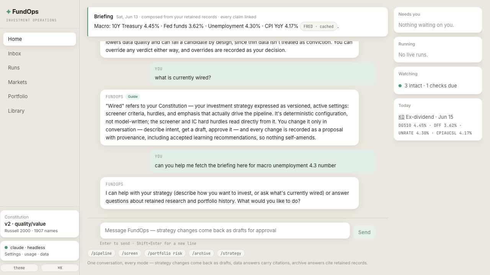
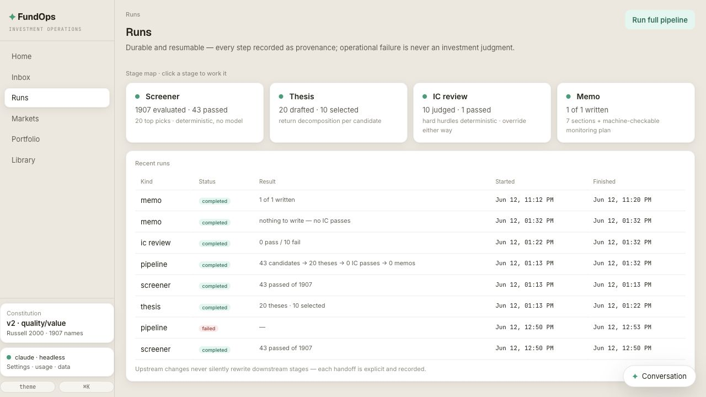
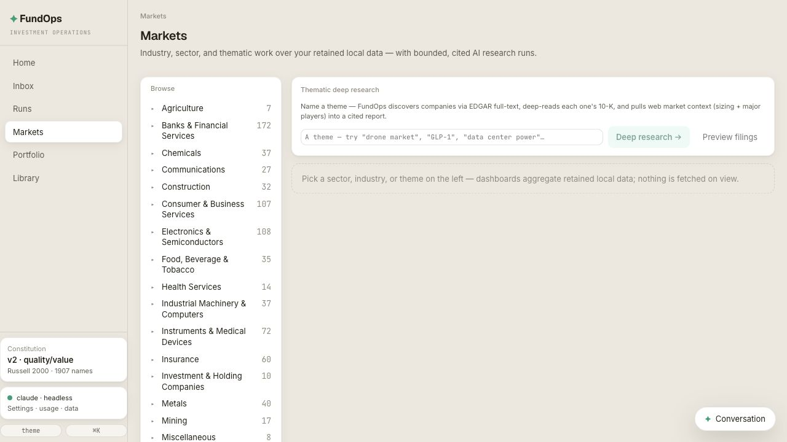
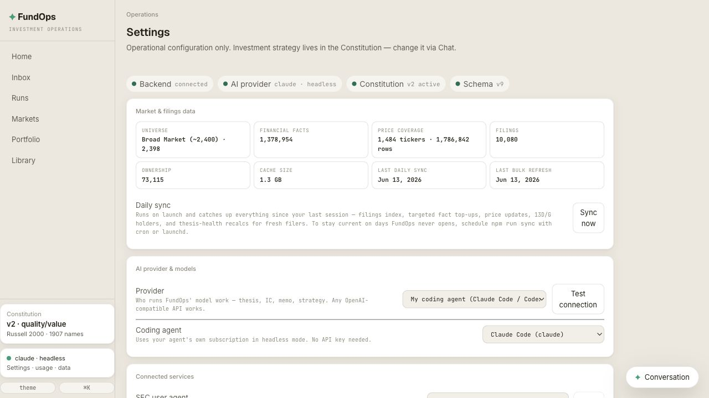

# FundOps

A local, AI-native investment operations workspace for one individual investor. FundOps turns
plain-English strategy into a versioned Constitution, runs a durable research pipeline over
retained market data, keeps source-backed evidence for every claim, and routes decisions back to
you in an Inbox — without ever delegating the investment decision to software.


## Screenshots

| Home command surface | Durable workflow runs |
|---|---|
|  |  |

| Markets research hub | Operations settings |
|---|---|
|  |  |

## What is this?

FundOps is an investment learning partner, not an autonomous fund manager. The AI helps you
articulate strategy, write evidence-backed research artifacts, explain what changed, and propose
reviewable improvements. Strategy activation, candidate promotion, memo selection, and portfolio
actions stay yours, made through explicit approvals.

The core loop:

```
Home Chat ──► Constitution (versioned criteria, deterministic wiring)
                  │
                  ▼
       Runs: Screener ─► Thesis ─► IC Review ─► Investment Memo
                  │                         │
                  ├──── evidence + artifacts┤
                  ▼                         ▼
        Markets / Company Pages       Thesis Health
                  │                         │
                  └──── Portfolio + Learning ────► Inbox
```

| Surface | What it does |
|---------|-------------|
| **Home** | The command surface: daily briefing, strategy chat, archive Q&A, data questions, slash commands, and the always-available conversation drawer. |
| **Inbox** | The unresolved decision queue: pending Constitution approvals, portfolio pressure, Constitution-fit opportunities, thesis breaks, learning recommendations, and visible operational failures. |
| **Runs** | Durable stage map for Screener → Thesis → IC Review → Memo. Each stage can run independently, resume, fail visibly, and hand off explicit selections downstream. |
| **Markets** | Sector, industry, watchlist, and thematic research over retained local data, with bounded cited AI research runs when you ask for deeper work. |
| **Screener** | Deterministically applies your Constitution's screening requirements to the active universe and ranks survivors by your approved blend. |
| **Thesis** | One-page AI-written opportunity arguments with explicit return-source decomposition, ranked by return profile for IC Review. |
| **IC Review** | The memo-worthiness gate: hard hurdles first, then a scored blend of conviction, Constitution fit, and data quality. You can override either way. |
| **Memo** | Structured seven-section Investment Memos plus a separate machine-checkable monitoring plan. |
| **Company Page** | Read-only ticker dossier: workflow history map, retained financials, filings/events, ownership evidence, artifacts, and memo-backed thesis health. |
| **Library** | Ticker-first archive lookup plus retained conversation history; opens the Company Page for any ticker FundOps has retained history on. |
| **Portfolio** | Ledger-first: purchase lots and sales in, holdings and realized/unrealized P&L projected out. Held positions can queue memo-backed thesis coverage. |
| **Settings** | Operations only: providers, models, usage records, sync status, data export, and destructive resets. Strategy never lives here. |

Everything generated is a structured, versioned, source-linked artifact tied to the exact
Constitution version, evidence bundle, and model steps that produced it.

## Installation

**Prerequisites:** Python 3.12+, Node.js 18+

```bash
git clone https://github.com/jhchang0407-lang/fundops.git
cd fundops
npm install        # sets up Python venv + backend + frontend
npm start          # → http://localhost:8000
```

### AI providers

FundOps can run its model work three ways:

- **OpenAI API** — set `OPENAI_API_KEY` in your environment for direct API access.
- **Your coding agent (Claude Code / Codex)** — point FundOps at the coding-agent CLI you
  already subscribe to, in Settings → Connected services. No API key needed; FundOps invokes
  the CLI headlessly and only when you explicitly choose it.
- **Offline stub** — with neither configured, FundOps runs in a deterministic offline mode
  (clearly marked in provenance) so you can explore the full workflow shape first.

## Getting started

1. **Describe your strategy in Chat** — e.g. *"Quality compounders at reasonable prices:
   ROIC above 15%, gross margin above 40%, low debt. Rank by FCF yield. Only memo-worthy
   ideas with 15%+ expected return."* FundOps drafts a Constitution: exact rules, plain-English
   interpretations, and a preview of how each workflow gets wired. Nothing activates until you
   approve.
2. **Run the workflow** — Screener → Thesis → IC Review → Memo, stage by stage or as one
   pipeline run. Promote/dismiss candidates at every stage; your selections are remembered as
   learning signals, never as silent rule changes.
3. **Enter your holdings** — purchase lots and sales. FundOps projects P&L from the ledger and
   queues memo-backed thesis coverage for anything you hold.
4. **Watch the Inbox** — thesis breaks, portfolio pressure, Constitution-fit opportunities,
   and learning recommendations arrive as reviewable, evidence-first items.

## Data sources

FundOps is bulk-first: breadth data arrives as official bulk products, downloaded once and kept
current with tiny daily index ticks. Live APIs are reserved for on-demand research — full filing
text for memos, fresh quotes during interactive runs.

| Source | Cost | Role |
|--------|------|------|
| **SEC `companyfacts.zip`** | Free | Reported fundamentals for the whole universe — one bootstrap download, refreshed weekly or on demand |
| **SEC daily index files** | Free | ~1–3 MB/day filing detection: who filed drives fact top-ups and thesis-health recalcs for exactly the affected tickers |
| **SEC quarterly ownership data sets** | Free | Insider transaction evidence for known entities |
| **Yahoo Finance (batched)** | Free | Price history for the universe, downloaded in batches; daily price updates ride the same sync tick |
| **OpenAI / your coding agent** | Usage-based or your existing subscription | Thesis/IC/memo writing, strategy interpretation. Tiered models (cheap for extraction, strong for deep work); every call is recorded as an AI Usage Record |

FundOps is built for sometimes-on use: on launch it catches up everything since your last
session (index files sync from the last recorded day, then targeted top-ups for exactly the
tickers that filed while you were away). To stay current even on days you don't open the app,
schedule a headless sync with your OS:

```bash
npm run sync                       # catch-up tick now (bootstraps on first run)
# cron example — weekdays at 6:30pm:
# 30 18 * * 1-5  cd ~/Repos/fundops && npm run sync
```

Ownership evidence comes from the same pipeline: insider transactions (Forms 3/4/5 quarterly
data sets) and largest 5%+ holders (Schedule 13D/G filings, parsed from their structured XML).
S-3/S-4 registration statements are retained as dilution/M&A events in the filings index.

The one-time bootstrap downloads ~2–3 GB; after that, daily ticks are ~1–3 MB. Total storage
footprint is roughly 3–5 GB at Russell 2000 scope (raw bulk cache + workspace database).

## Architecture

```
backend/
├── core/        # workspace DB + migrations, AI gateway (tiered, recorded, stubbed offline), config
├── domain/      # pure deterministic logic: criteria, guardrails, wiring, IC gate math,
│                # thesis-health evaluation, ledger math, artifact contracts, metric catalog
├── stores/      # platform stores — the ONLY write path to the workspace database
├── services/    # application services: market data, portfolio, inbox projection, strategy
│   └── ingest/  # bulk-first ingestion: SEC companyfacts + daily indexes + ownership, batched prices
├── workflows/   # durable workflow runs: screener, thesis, ic_review, memo, thesis_health,
│                # learning, pipeline
├── chat/        # FundOps Chat: strategy chat + archive Q&A
├── connectors/  # SEC EDGAR + Yahoo Finance adapters
└── api/         # thin FastAPI route adapters + SPA serving
frontend/src/    # React 19 + TS: Home, Inbox, Runs, Markets, workflow pages, Company Page,
                 # Library, Portfolio, Settings, Artifact Reader — custom app design system
tests/platform/  # backend invariants: ledger math, guardrails, IC scoring, thesis health,
                 # workflow contracts, chat behaviors
```

Key invariants:

- **One workspace, one owner, one active Constitution, one primary portfolio.** Constitution
  versions are immutable; activation requires an explicitly accepted proposal that passed
  deterministic guardrails.
- **Reported facts ≠ calculated observations.** Both are retained with lineage; corrections
  supersede rather than overwrite; every calculated value records the metric-catalog version.
- **Artifacts are append-only.** Historical outputs are never edited in place — new versions
  supersede, and every artifact records its evidence bundle and Constitution version.
- **Projections are rebuildable.** Holdings, inbox items, library lookups, and latest
  financials are derived views over retained records, never independent truth.
- **Operational failure ≠ investment judgment.** Retries and failures stay visible as
  operational state; they never become verdicts or learning evidence.

Product truth lives in [CONTEXT.md](CONTEXT.md), [docs/adr/](docs/adr/), and
[docs/implementation-map.md](docs/implementation-map.md).

## Development

```bash
npm test                                          # backend tests + frontend typecheck
.venv/bin/python -m pytest tests/platform -q      # backend platform tests only
cd frontend && npm run dev                        # frontend dev server with API proxy
cd frontend && npm run build                      # production build
```

## Environment variables

| Variable | Required | Description |
|----------|----------|-------------|
| `OPENAI_API_KEY` | No | Enables AI generation (offline stub mode without it) |
| `FUNDOPS_DB` | No | Workspace database path (default `~/.fundops/workspace.db`) |
| `FUNDOPS_CONFIG` | No | Operational config path (default `~/.fundops/config.yaml`) |
| `FUNDOPS_CACHE` | No | Bulk data cache directory (default `~/.fundops/cache`) |
| `FUNDOPS_SECRETS` | No | Credentials file path (default `~/.fundops/credentials.yaml`) |
| `FUNDOPS_AI_PROVIDER` | No | Override the AI provider: `openai` \| `agent_cli` \| `stub` |
| `SEC_USER_AGENT` | No | User-Agent for SEC EDGAR requests, per SEC fair-use policy |

## License

MIT
